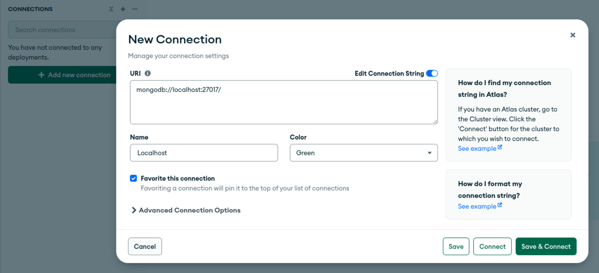
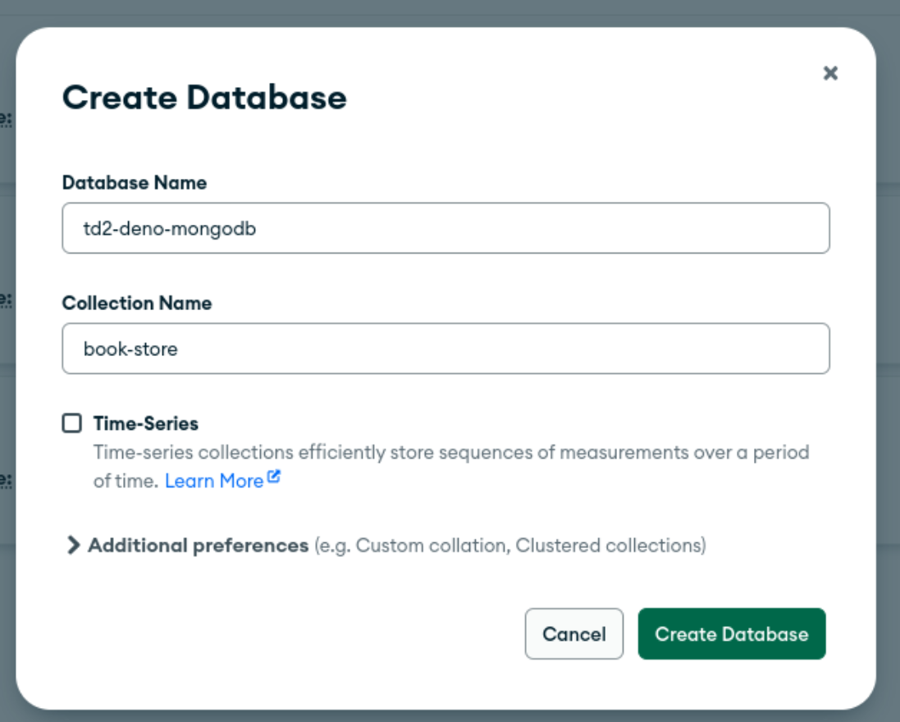

# TP2 Deno avec MongoDb

## Installations

### Installation MongoDb

Installer [Mongo](https://www.mongodb.com/docs/manual/installation/)

Installer la GUI avec [MongoCompass](https://www.mongodb.com/try/download/compass)

### Initialiser la BDD

> TIPS : Est-ce que le nom de la première collection est pertinente ?

## Consignes

> [Documentation deno](https://deno.land/x/mongo@v0.34.0)

* Reprendre le TD ou TP d'hier et remplacer dans la couche repository l'objet en mémoir par mongodb.
* Implémenter les DTOs, Domains et DBOs

> Exemple de [projet](https://github.com/Prolifode/deno_rest) qui implémente mongodb
